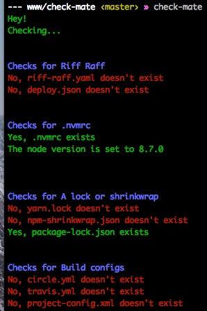

# check-mate

> Your mate to check files or modules exist in your project

*Note:* WIP, pretty messy codebase...




## CLI

```
$ npm install --global check-mate
```

```
Usage
  $ check-mate
  // Run on a project folder

Examples
  $ check-mate
  // Will check the default files exist
```

## Contribute

https://github.com/gtrufitt/check-mate

### Add checkers

Add a function to `lib/checkers.js` that returns a Promise and resolves with a `chalk`ified string.

E.g:

```js
checkFileExists: ({humanName, fileName, checker}) => {
  return new Promise(function(resolve, reject) {

    const checkFile = (fileName) =>
       (fs.existsSync(fileName)) ? chalk.green(`Yes, ${fileName} exists`) : chalk.red(`No, ${fileName} doesn't exist`);

    (typeof fileName === 'string') ? resolve(checkFile(fileName)) : resolve(fileName.map(checkFile).join(endOfLine));

  });
```

You can then use this in the `lib/mates.js` file, by adding an object, with your new function in the checkers array:

```
{humanName: 'Riff Raff', fileName: ['riff-raff.yaml', 'deploy.json'], checkers: [checkFileExists]}
```

### Add mates

As above, you can add mates in the `lib/mates.js`. Mates should have a `humanName` that'll be used in the check title (`Checks for *Linting*`) and then some 'checker' specific properties (checkers use destructuring to grab the ones they want).

### Publish

`npm i -g np`

then

`np <versionType>`

## TODO

- Lint
- Choose to not show the message if something doesn't exist?
- Custom checkers as an option / override defaults

## License

MIT © [Gareth Trufitt](http://trufitt.com)
